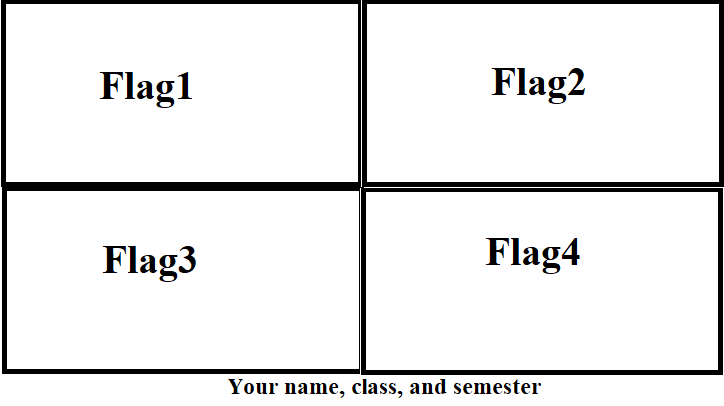

# Lab 9: The American Flag
In this lab, we will use Java Graphics capabilities to draw different versions of the American Flag.
Before starting this assignment, you may want to review the following material:
* zyBook: 16.1

## History of the American Flag
The American Flag has evolved over time. This [Wikipedia article](https://en.wikipedia.org/wiki/Flag_of_the_United_States#History) provides an overview of this evolution.
In this lab, we will draw **the current American Flag and the 13-star Betsy Ross variant**. 

## Tasks

You are asked to use `swing` and `awt` to draw your variants. Your final output should contain 4 flags: **the current American flag, the 13-star Betsy Ross variant, and black-and-white versions of both**. You'll also write your name, class, and semester at the bottom of the frame. Your output layout should be similar to the figure below:

  

 

You are free to use any dimensions for the frame, but all flags should be of the same dimensions. You are also free to order the flags in the layout in any order. You'll need to write your information at the bottom using Java Graphics.

There are many examples on the internet that draw the American flag using Java, such as [this one](https://www.javacodex.com/More-Examples/2/10). You can use it as a starting point for your code. However, your final code should use Object-Oriented Programming concpets to produce your final output with the four flags. Your code should also be as modular as possible (split larger code into smaller methods, re-use methods when applicable).

This repository provides you with a single class `Driver.java` which should contain your `main` method. You'll need to implement this method, and add as many classes and method as you see appropriate to produce the final output.

## Submission

There is no Zylab submission for this lab. You'll submit the requirements through GitHub (to your repository). Your submission should consist of two parts:
* Code submission on GitHub: You are expected to commit and push the code that produces the expected output. Your code should be modular and make use of object-oriented programming.
* Screenshot submission of the output: You'll need to submit a screenshot of the output that you produce. Upload this screenshot to the `output` directory of this repository.

On Canvas, you'll submit your repository's GitHub link to be graded manually.
